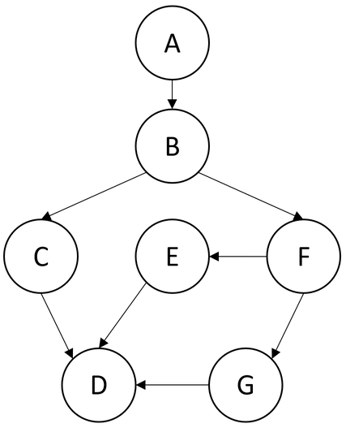
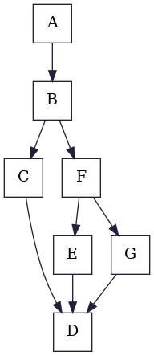
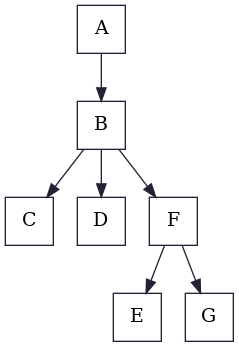
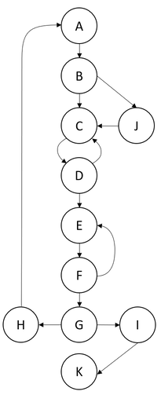
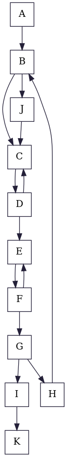
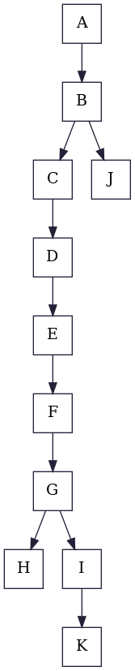
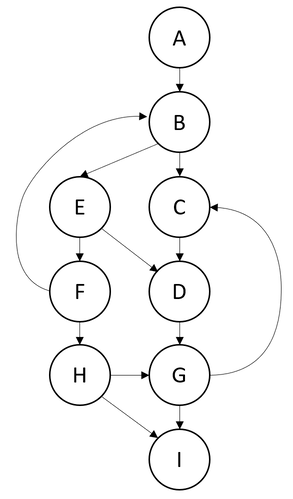
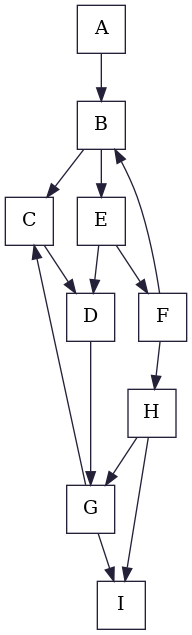
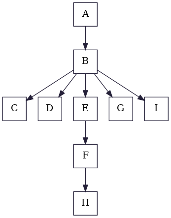

# Example 1
|

 |

 |

 |
|:-:                                                               |:-:                                                           |:-:                                                               |
|                           Graph From Lecture                     |                           Control Flow Graph                 |                               Dominator Tree                     |

# Example 2
|

 |

 |

 |
|:-:                                                               |:-:                                                           |:-:                                                               |
|                           Graph From Lecture                     |                           Control Flow Graph                 |                               Dominator Tree                     |

# Example 3
|

 |

 |

 |
|:-:                                                               |:-:                                                           |:-:                                                               |
|                           Graph From Lecture                     |                           Control Flow Graph                 |                               Dominator Tree                     |

