# Example Linear Order 1
|

 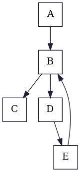|

 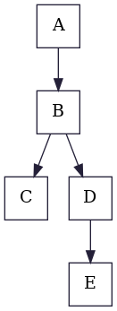|

 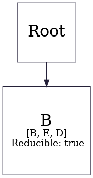|
|:-:                                                           |:-:                                                               |:-:                                                                |
|                           Control Flow Graph                 |                               Dominator Tree                     |                               LoopTree                            |

# Example Linear Order 2
|

 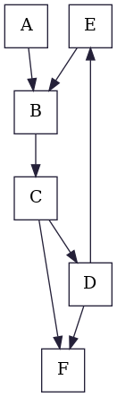|

 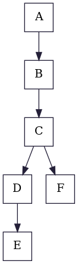|

 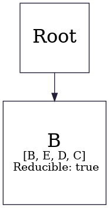|
|:-:                                                           |:-:                                                               |:-:                                                                |
|                           Control Flow Graph                 |                               Dominator Tree                     |                               LoopTree                            |

# Example Linear Order 3
|

 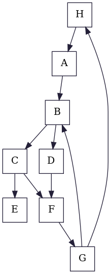|

 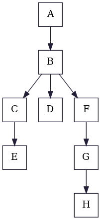|

 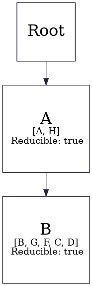|
|:-:                                                           |:-:                                                               |:-:                                                                |
|                           Control Flow Graph                 |                               Dominator Tree                     |                               LoopTree                            |

# Example Linear Order 4
|

 |

 |

 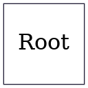|
|:-:                                                           |:-:                                                               |:-:                                                                |
|                           Control Flow Graph                 |                               Dominator Tree                     |                               LoopTree                            |

# Example Linear Order 5
|

 |

 |

 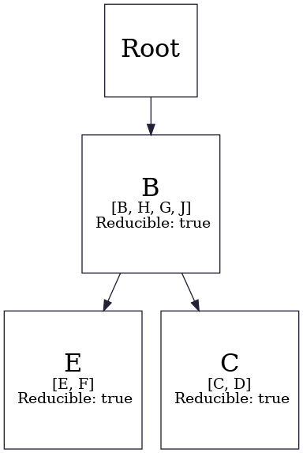|
|:-:                                                           |:-:                                                               |:-:                                                                |
|                           Control Flow Graph                 |                               Dominator Tree                     |                               LoopTree                            |

# Example Linear Order Big
|

 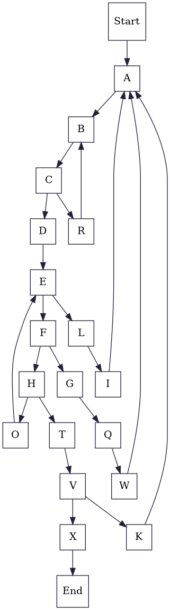|

 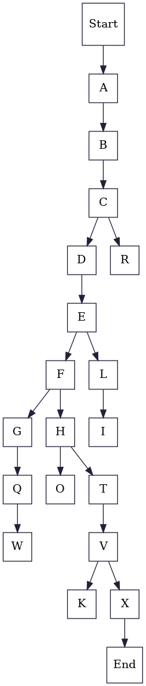|

 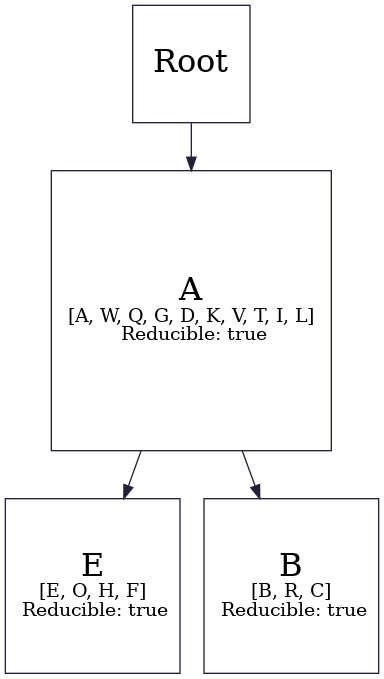|
|:-:                                                             |:-:                                                                 |:-:                                                                  |
|                           Control Flow Graph                   |                               Dominator Tree                       |                               LoopTree                              |

# Example Linear Order From Lecture 1
|

 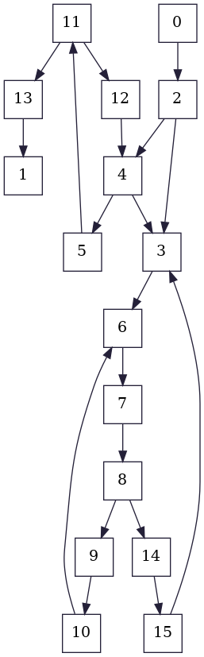  |

 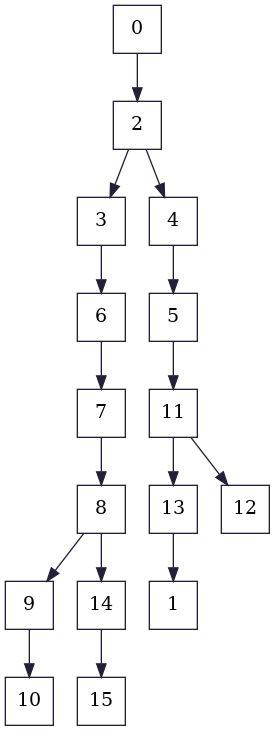  |

 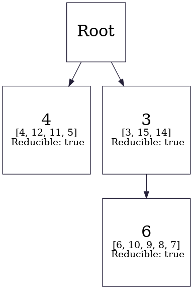 |
|:-:                                                                            |:-:                                                                                |:-:                                                                                |
|                           Control Flow Graph                                  |                               Dominator Tree                                      |                               LoopTree                                            |

# Example Linear Order From Lecture 2
|

 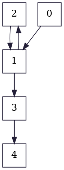  |

 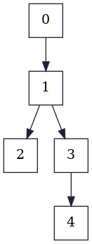  |

 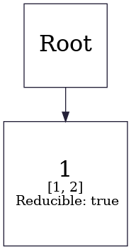 |
|:-:                                                                            |:-:                                                                                |:-:                                                                                |
|                           Control Flow Graph                                  |                               Dominator Tree                                      |                               LoopTree                                            |

# Example Linear Order Triple Nested Loop
|

 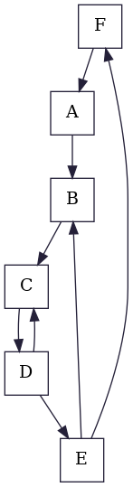 |

 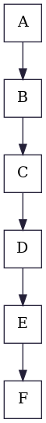 |

 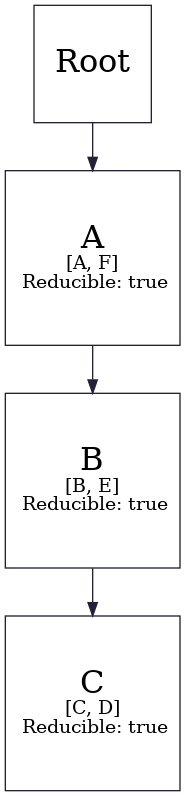    |
|:-:                                                                    |:-:                                                                        |:-:                                                                            |
|                           Control Flow Graph                          |                               Dominator Tree                              |                               LoopTree                                        |

# Example Linear Order Quadruple Nested Loop
|

 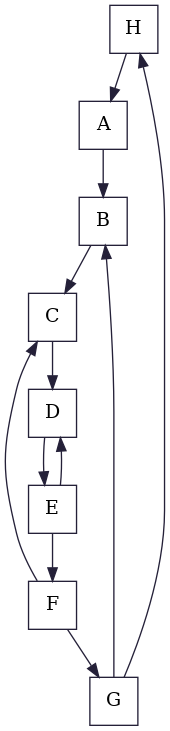  |

 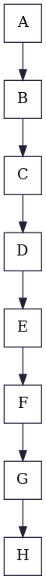  |

 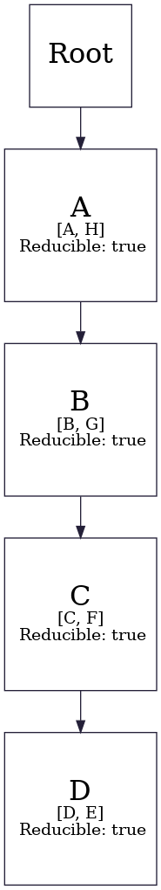 |
|:-:                                                                        |:-:                                                                            |:-:                                                                            |
|                           Control Flow Graph                              |                               Dominator Tree                                  |                               LoopTree                                        |

# Example Linear Order Quintuple Nested Loop
|

 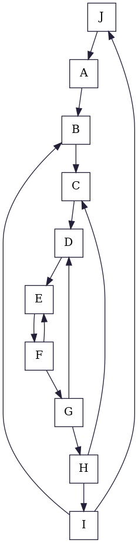  |

 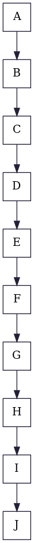  |

 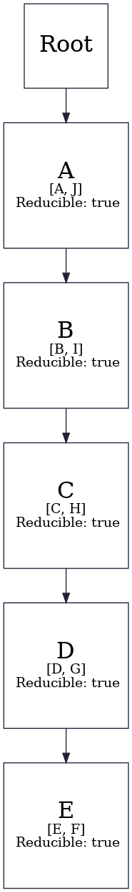 |
|:-:                                                                        |:-:                                                                            |:-:                                                                            |
|                           Control Flow Graph                              |                               Dominator Tree                                  |                               LoopTree                                        |

# Example Liveness Factorial Recursive
|

 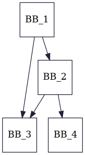    |

     |

    |
|:-:                                                                    |:-:                                                                        |:-:                                                                        |
|                           Control Flow Graph                          |                               Dominator Tree                              |                               LoopTree                                    |

# Example Liveness Factorial Loop
|

 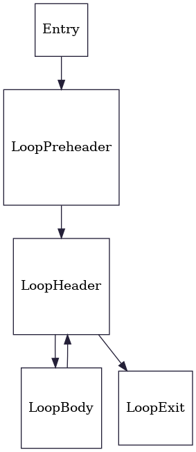 |

 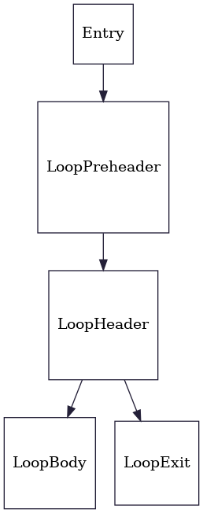 |

 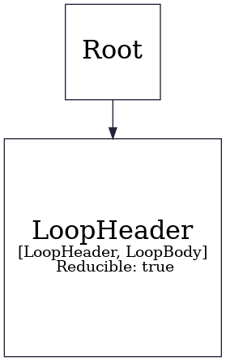    |
|:-:                                                            |:-:                                                                |:-:                                                                    |
|                           Control Flow Graph                  |                               Dominator Tree                      |                               LoopTree                                |

# Example Liveness From Lecture 1
|

 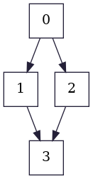 |

  |

     |
|:-:                                                                        |:-:                                                                            |:-:                                                                                |
|                           Control Flow Graph                              |                               Dominator Tree                                  |                               LoopTree                                            |

# Example Liveness From Lecture 2
|

 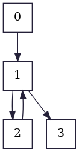 |

 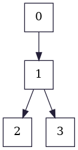 |

     |
|:-:                                                                        |:-:                                                                            |:-:                                                                                |
|                           Control Flow Graph                              |                               Dominator Tree                                  |                               LoopTree                                            |