# Example 1
|

 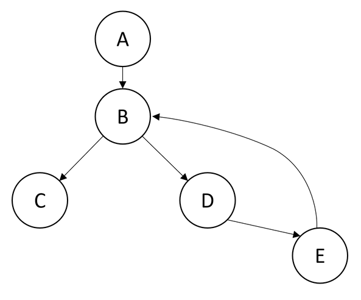|

 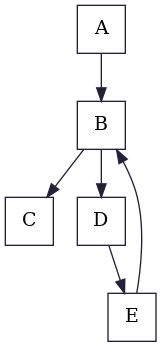|

 |

 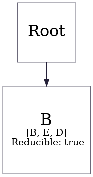|
|:-:                                                               |:-:                                                           |:-:                                                               |:-:                                                                |
|                           Graph From Lecture                     |                           Control Flow Graph                 |                               Dominator Tree                     |                               LoopTree                            |

# Example 2
|

 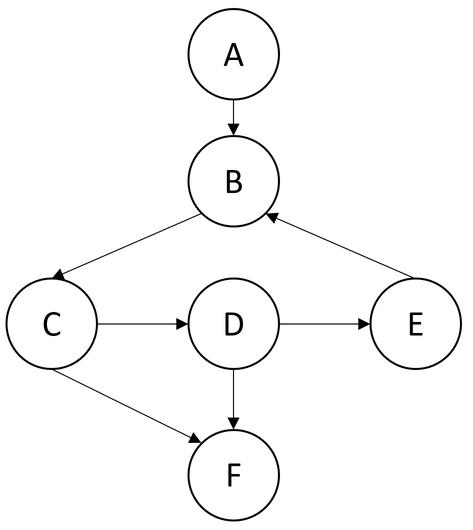|

 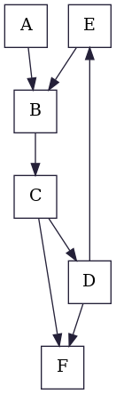|

 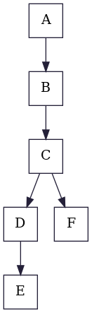|

 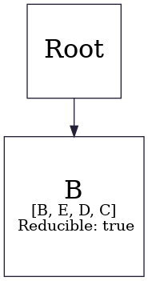|
|:-:                                                               |:-:                                                           |:-:                                                               |:-:                                                                |
|                           Graph From Lecture                     |                           Control Flow Graph                 |                               Dominator Tree                     |                               LoopTree                            |

# Example 3
|

 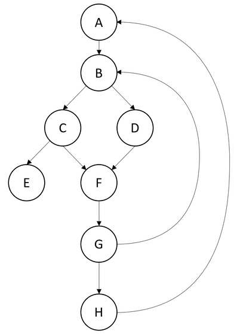|

 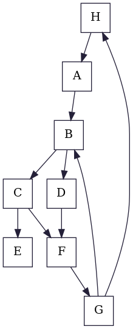|

 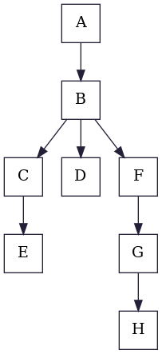|

 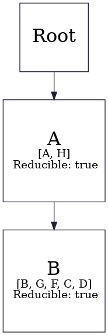|
|:-:                                                               |:-:                                                           |:-:                                                               |:-:                                                                |
|                           Graph From Lecture                     |                           Control Flow Graph                 |                               Dominator Tree                     |                               LoopTree                            |

# Example 4
|

 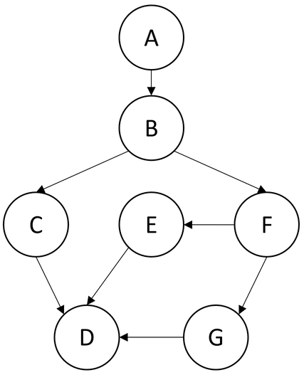|

 |

 |

 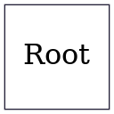|
|:-:                                                               |:-:                                                           |:-:                                                               |:-:                                                                |
|                           Graph From Lecture                     |                           Control Flow Graph                 |                               Dominator Tree                     |                               LoopTree                            |

# Example 5
|

 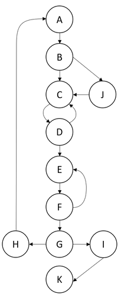|

 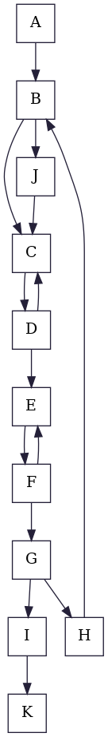|

 |

 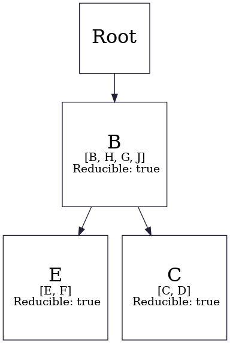|
|:-:                                                               |:-:                                                           |:-:                                                               |:-:                                                                |
|                           Graph From Lecture                     |                           Control Flow Graph                 |                               Dominator Tree                     |                               LoopTree                            |

# Example 6
|

 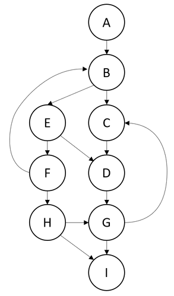|

 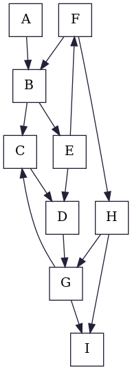|

 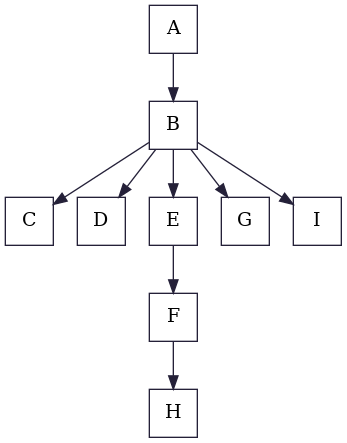|

 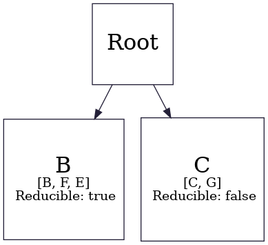|
|:-:                                                               |:-:                                                           |:-:                                                               |:-:                                                                |
|                           Graph From Lecture                     |                           Control Flow Graph                 |                               Dominator Tree                     |                               LoopTree                            |

# Example Big
|

 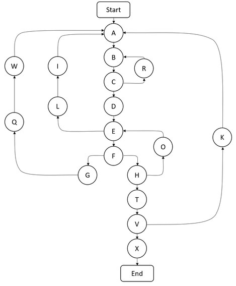|

 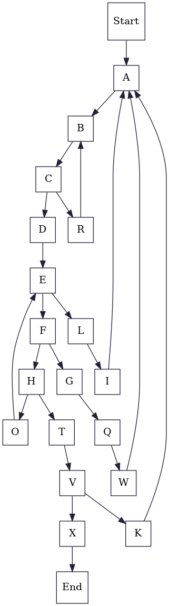|

 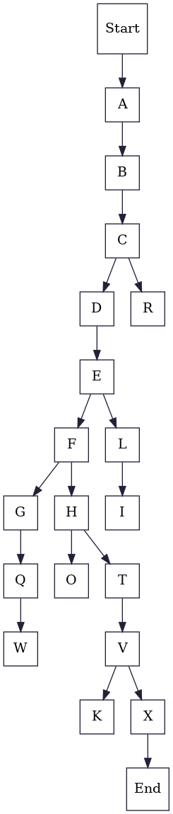|

 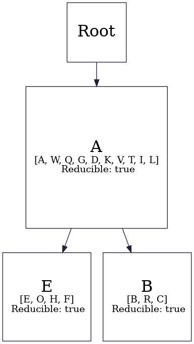|
|:-:                                                                 |:-:                                                             |:-:                                                                 |:-:                                                                  |
|                           Graph From Lecture                       |                           Control Flow Graph                   |                               Dominator Tree                       |                               LoopTree                              |