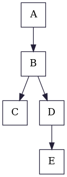
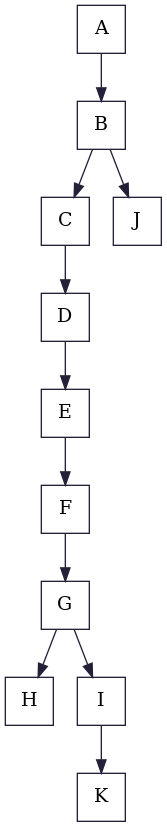

# Example 1
|   

       | 

     |   

  |
|:-:                                                                    |:-:                                                                    |:-:                                                                    |
|                           Control Flow Graph                          |                               Dominator Tree                          |                               LoopTree                                |

# Example 2
|   

       | 

     |   

  |
|:-:                                                                    |:-:                                                                    |:-:                                                                    |
|                           Control Flow Graph                          |                               Dominator Tree                          |                               LoopTree                                |

# Example 3
|   

       | 

     |   

  |
|:-:                                                                    |:-:                                                                    |:-:                                                                    |
|                           Control Flow Graph                          |                               Dominator Tree                          |                               LoopTree                                |

# Example 4
|   

       | 

     |   

  |
|:-:                                                                    |:-:                                                                    |:-:                                                                    |
|                           Control Flow Graph                          |                               Dominator Tree                          |                               LoopTree                                |

# Example 5
|   

       | 

     |   

  |
|:-:                                                                    |:-:                                                                    |:-:                                                                    |
|                           Control Flow Graph                          |                               Dominator Tree                          |                               LoopTree                                |

# Example 6
|   

       | 

     |   

  |
|:-:                                                                    |:-:                                                                    |:-:                                                                    |
|                           Control Flow Graph                          |                               Dominator Tree                          |                               LoopTree                                |

# Example Big
|   

     | 

   |   

    |
|:-:                                                                    |:-:                                                                    |:-:                                                                        |
|                           Control Flow Graph                          |                               Dominator Tree                          |                               LoopTree                                    |